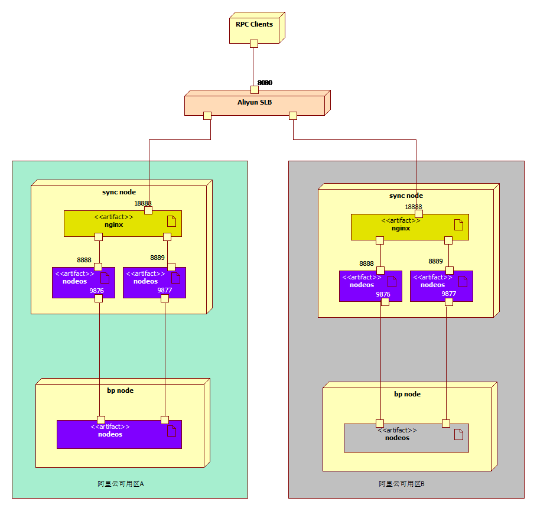

如何配置EOS Force的HA超级节点？

EOS Force原力的超级节点正在如火如荼的投票中，coinlord.one荣幸地被社区投票成为其中一个超级节点。超级节点的一项重要任务就是维护主网稳定的出块，因此，在服务器配置方案中，务必要选择HA模式，增强节点的健壮性。近日，coinlord.one参考官方推荐的HA方案（官方参考方案请访问：<https://github.com/eosforce/eos-bp-security-deployment-guide>），成功地在阿里云配置了HA（High Availability）高可用的BP节点。下面，分享一下我们的配置，抛砖引玉。

首先上部署图：




如图所示，HA超级节点的服务器创建在阿里云两个不同的可用区，每个可用区包含一个或多个sync node阿里云ECS服务器（作为同步节点，并对外提供RPC访问服务），和一个bp node阿里云ECS服务器（作为出块节点）。每个sync node服务器包含两个nodeos docker  container，由nginx作为反向代理对外提供RPC服务。sync node服务器通过阿里云的SLB（Server Load Banlancer）服务做负载均衡。bp node服务器绑定私网IP，部署一个nodeos dockercontainer，只和同一个可用区的sync node服务器相连。不同可用区的bp node服务器只有一个处于master状态，可以作为BP出块，而另一个可用区的bp node处于slave状态，只和sync node服务器同步区块。
由于nodeos是单线程的程序，而且目前交易量比较小，我们选择2cpu4G内存的服务器配置作为bp node服务器，4cpu8G内存的配置作为sync node同步服务器。同步服务器以后可以根据负载增加服务器的个数，或扩展服务器的配置规格。


# Sync node服务器的配置
同步服务器（sync node）启动两个nodeos作为同步节点，参考官方的配置（https://github.com/eosforce/genesis ），配置两个同步节点：s1和s2。

注意：

- s1和s2对外P2P连接的端口不同。
- s1和s2配置的p2p-peer-address不同，否者后启动的节点不能建立p2p连接。

s1的配置如下

配置文件名：config.sync1.ini

配置内容：

```bash
chain-state-db-size-mb = 4096

# The local IP and port to listen for incoming http connections; set blank to disable. (eosio::http_plugin)
http-server-address = 127.0.0.1:8888
access-control-allow-origin = *
access-control-allow-headers = Content-Type
access-control-allow-credentials = false

p2p-listen-endpoint = 0.0.0.0:9876
p2p-server-address = <服务器公网IP>:9876

p2p-peer-address = 47.52.54.232:18933
p2p-peer-address = 47.75.138.177:9876
p2p-peer-address = 132.232.104.44:8001
p2p-peer-address = 47.91.175.9:15888
p2p-peer-address = 47.93.38.143:19951

max-clients = 25

# 设置 filter-on = *, get-actions-on = true 可以获取全部的交易记录
# 这两个配置项一般用于浏览器，钱包等
filter-on = *
get-actions-on = true

plugin = eosio::chain_api_plugin
plugin = eosio::history_plugin
plugin = eosio::history_api_plugin
```

s2的配置如下：

配置文件名：config.sync2.ini

配置内容：

```bash
chain-state-db-size-mb = 4096
# The local IP and port to listen for incoming http connections; set blank to disable. (eosio::http_plugin)
http-server-address = 127.0.0.1:8889
access-control-allow-origin = *
access-control-allow-headers = Content-Type
access-control-allow-credentials = false

p2p-listen-endpoint = 0.0.0.0:9877

p2p-server-address = <服务器公网IP>:9877

p2p-peer-address = 112.74.179.235:9876
p2p-peer-address = 47.91.175.9:15888
p2p-peer-address = 47.52.126.100:9123
p2p-peer-address = 47.97.122.109:7894
p2p-peer-address = 47.96.232.211:8899

max-clients = 25

# 设置 filter-on = *, get-actions-on = true 可以获取全部的交易记录
# 这两个配置项一般用于浏览器，钱包等
filter-on = *
get-actions-on = true

plugin = eosio::chain_api_plugin
plugin = eosio::history_plugin
plugin = eosio::history_api_plugin
```
**如上所述: s2的配置和s1的配置基本相同，不同的是需要修改p2p配置部分**

在官网clone下来的genesis配置目录下编写启动s1的脚本，并在genesis目录下执行：
```bash
echo "start sync1 container..."
mkdir -p ~/dockernode/sync1/eosforce
mkdir -p ~/dockernode/sync1/nodeos/eosforce
cp  genesis.json *.wasm *.abi  ~/dockernode/sync1/eosforce
cp config.sync1.ini   ~/dockernode/sync1/eosforce/config.ini

sudo docker run -d --restart=always --name sync1 -v ~/dockernode/sync1/eosforce:/opt/eosio/bin/data-dir -v ~/dockernode/sync1/nodeos/eosforce:/root/.local/share/eosio/nodeos -p 8888:8888 -p 9876:9876 eosforce/eos:v1.0 nodeosd.sh
```
在genesis目录下，编写并执行启动s2的脚本：

```bash
echo "start sync2 container..."
mkdir -p ~/dockernode/sync2/eosforce
mkdir -p ~/dockernode/sync2/nodeos/eosforce
cp genesis.json *.wasm *.abi  ~/dockernode/sync2/eosforce
cp config.sync2.ini   ~/dockernode/sync2/eosforce/config.ini

sudo docker run -d --restart=always --name sync2 -v ~/dockernode/sync2/eosforce:/opt/eosio/bin/data-dir -v ~/dockernode/sync2/nodeos/eosforce:/root/.local/share/eosio/nodeos -p 8889:8889 -p 9877:9877 eosforce/eos:v1.0 nodeosd.sh
```

同步节点sync1和sync2启动后，我们可以看看docker进程：

```bash
bpadmin@g-syncnode:~/eosforce/genesis$ sudo docker ps
CONTAINER ID        IMAGE               COMMAND             CREATED             STATUS              PORTS                                            NAMES
2dc9e8048446        eosforce/eos:v1.0   "nodeosd.sh"        6 days ago          Up 29 hours         0.0.0.0:8889->8889/tcp, 0.0.0.0:9877->9877/tcp   sync2
c4ccb9c421bb        eosforce/eos:v1.0   "nodeosd.sh"        6 days ago          Up 16 minutes       0.0.0.0:8888->8888/tcp, 0.0.0.0:9876->9876/tcp   sync1
```
# bp node服务器的配置
## 启动配置
bp node节点刚开始启动时，配置成slave模式，和同步节点相连同步完所有的区块后，再把其中一个bp node切换成出块节点，另一个保持slave模式不变。

配置文件: config.slave.ini

配置内容：

```bash
chain-state-db-size-mb = 4096

http-server-address =

p2p-listen-endpoint = <inbound ip>:9876  # 只允许自己的同步节点连接, 实际部署时换成其他随机端口.
p2p-peer-address = xx.xx.xx.xx:9876      # 自己的 BP 的同步节点, 实际部署时换成其他随机端口.
p2p-peer-address = xx.xx.xx.xx:9877      # 自己的 BP 的同步节点, 实际部署时换成其他随机端口.
```

master出块节点也和同步节点相连，除了同步区块，还承担出块工作。

配置文件: config.master.ini

配置内容：
```bash

chain-state-db-size-mb = 4096

# 空表示禁用
http-server-address =

p2p-listen-endpoint = <inbound ip>:9876  # 只允许自己的同步节点连接, 实际部署时换成其他随机端口.
p2p-peer-address = xx.xx.xx.xx:9876      # 自己的 BP 的同步节点, 实际部署时换成其他随机端口.
p2p-peer-address = xx.xx.xx.xx:9877      # 自己的 BP 的同步节点, 实际部署时换成其他随机端口.


enable-stale-production = false
max-clients = 2 # 即连接的两个同步节点
producer-name = <出块账户名称>
signature-provider = <pubkey>=KEY:<privkey>
```

配置文件准备好后，在genesis目录下准备个启动脚本启动docker容器：

```bash

echo "start bp container..."
mkdir -p ~/dockernode/bp/eosforce
mkdir -p ~/dockernode/bp/nodeos/eosforce
cp  genesis.json *.wasm *.abi  ~/dockernode/bp/eosforce
cp config.slave.ini   ~/dockernode/bp/eosforce/config.ini

sudo docker run -d --restart=always --name slave -v ~/dockernode/bp/eosforce:/opt/eosio/bin/data-dir -v ~/dockernode/bp/nodeos/eosforce:/root/.local/share/eosio/nodeos  -p 9876:9876 eosforce/eos:v1.0 nodeosd.sh

```

配置好了之后，最开始bp node出块节点出于slave状态，编写脚本，让出块节点在slave和master之间可以方便地切换。


## 从slave状态切换到master状态

slave2master.sh
```bash
# 停止slave container
sudo docker stop  slave

# 配置替换成master的配置
cp config.master.ini   ~/dockernode/bp/eosforce/config.ini

# 启动slave container
sudo docker start slave

# 修改slave container的名字为master
sudo docker rename slave master

```

## 从master状态切换到slave状态

```bash
# 停止master container
sudo docker stop master

# 配置替换成slave的配置
cp config.slave.ini   ~/dockernode/bp/eosforce/config.ini

# 启动master container
sudo docker start master

# 修改master container的名字为slave
sudo docker rename master slave

```

执行这两个脚本就可是使出块节点在master和slave之间来回切换了。由于有两个出块节点，一个master，一个slave，配置的时候，需要非常小心，避免把连个节点都配成master，会导致同一个BP产生高度相同的两个块，造成区块分叉。

本文的脚本放在coinlord.one的官方github，欢迎访问<https://github.com/coinlord/bpha>。


Any comments are welcome！

